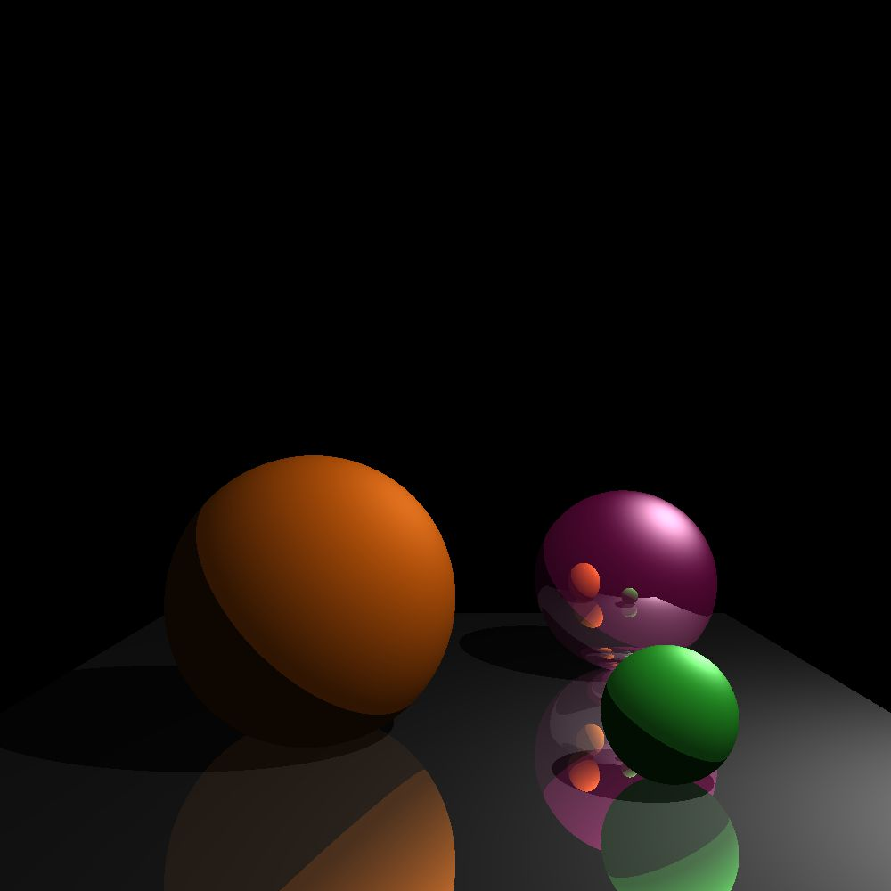

# Ray-Tracer-

## Table of Contents

- [Introduction](#Introduction)
- [Usage](#usage)
- [Customization](#customization)

## Introduction
This project is a simple ray tracer implemented in C++ designed to render 3D scenes with basic geometric shapes, lighting, and reflection effects. The core features include rendering spheres and a ground plane with basic diffuse, specular, and ambient lighting.




## Dependencies
-C++11 compatible compiler.
-bitmap_image.hpp for image operations.

## Usage

### Compile
```bash
g++ -o raytracer main.cpp -std=c++11
```
### Run the executable
```bash
./raytracer
```
### Follow the prompts

You will be asked to enter parameters for sphere colors, material properties (Ka, Kd, Ks), global ambient light intensity, specular exponent, and light intensity.

### Output will be saved as 'image.bmp' 

### OR Simply run the main.exe on Windows

## Customization

You can also alter the scene by editing the source code:
Change sphere positions, sizes, and material properties in main().
Adjust the camera's position and the light source's settings to modify the scene's appearance.

